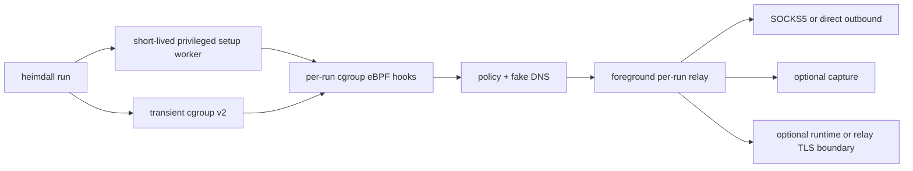

<p align="center">
  
</p>

<h1 align="center">Heimdall</h1>

<p align="center">
  A command-scoped TCP/UDP proxy with transparent TLS inspection for CLI tools and AI agents.
</p>

<p align="center">
  <a href="LICENSE"></a>
  
  
  
  <a href="ROADMAP.md"></a>
</p>

Heimdall runs one command, and its entire descendant process tree, through a
named SOCKS5 egress policy. It is designed for terminal workflows where a
single command needs controlled routing without changing shell-wide proxy
environment variables or using `LD_PRELOAD`.

The mark uses Bifröst as a boundary metaphor: the navy arch is the guarded
crossing, and the spectrum path is the route selected by policy. It describes
the product's scope and visibility; Heimdall is not a general-purpose VPN.

> [!WARNING]
> Heimdall is pre-1.0 software. The command wrapper is usable today, but
> machine-readable contracts and TLS capabilities may evolve. Read the
> [roadmap](ROADMAP.md) before building product or automation dependencies on
> an unreleased surface.

## Why Heimdall?

- **One command, one scope** — only `heimdall run` and its descendants are
  redirected; unrelated processes keep their normal network path.
- **Kernel-level coverage** — cgroup eBPF hooks cover dynamic and static
  binaries without interposing a language-specific socket library.
- **Explicit policy** — named outbounds, ordered TCP/UDP rules, fake-DNS
  hostname preservation, direct egress, and fail-closed rejects share one
  strict schema.
- **Three deliberate data boundaries** — proxying, bounded opaque capture, and
  TLS decryption are independent opt-in decisions.
- **Agent-friendly operations** — `heimdall agent` is a read-only, versioned
  JSON preflight with stable error codes and shell-safe argv actions.

## Current status

The shipped core is real and tested; the alpha label reflects the breadth of
Linux kernels, runtimes, TLS libraries, and deployment environments that still
need compatibility hardening.

| Area | Status | Current boundary |
| --- | --- | --- |
| Command-scoped TCP and UDP proxying | Available | IPv4/IPv6, SOCKS5 and direct egress, fake DNS, ordered policies |
| macOS support | Planned | Wrapper fallback and Network Extension backend are roadmap items; not currently available |
| Strict configuration and agent contract | Available | TOML, YAML, JSON; `heimdall.agent/v5` with execution ownership and repairable diagnostics |
| Daemonless Linux execution | Available | `off` and `relay` runs own per-run relay, DNS, maps, links, and logs; the setup worker exits before the command starts |
| Opaque flow capture | Available | Explicit bounded JSONL capture under the invoking user's ownership with `heimdall.capture/v1` |
| Agent event logs | Available, Phase 1 | Per-run lifecycle and TCP/UDP metadata in `heimdall.event/v1`; payload remains in legacy capture |
| Runtime TLS decryption | Compatibility mode | OpenSSL probes currently require the explicit compatibility daemon; no CA injection |
| Relay TLS decryption | Available daemonless with alpha limits | Local CA plus per-host leaves; client trust and protocol compatibility are required |
| Runtime and kernel compatibility | In development | Expanding the tested matrix and documenting unsupported edge cases |
| Capture analysis and release packaging | Planned | Better inspection workflows and reproducible distribution artifacts |

See [ROADMAP.md](ROADMAP.md) for the source of truth, status definitions, and
the explicit non-goals.

## Architecture



For normal `off` and `relay` runs, the foreground CLI owns the relay, fake-IP
DNS, event writer, cgroup, maps, and links. A narrow privileged worker attaches
eBPF and transfers owned file descriptors back to the CLI, then exits before
the wrapped command starts. The CLI waits for the complete descendant tree and
closes every per-run resource. Processes outside that cgroup are left alone.

Unlike `proxychains4`, Heimdall does not use `LD_PRELOAD`. The privileged
setup worker attaches cgroup eBPF hooks, so static binaries and mixed-language
process trees share the same interception boundary. See
[docs/architecture.md](docs/architecture.md) for data flow and failure
semantics.

## Quick start

### Requirements

- Linux 5.10 or newer
- cgroup v2 and a running systemd user manager
- Nix with flakes enabled for the pinned development toolchain
- A reachable SOCKS5 server
- `sudo` authorization for the exact hidden `heimdall __setup-worker` command

Build eBPF before userspace because the object is embedded into the binary:

```bash
git clone https://github.com/dravengarden/heimdall.git
cd heimdall

nix develop .#ebpf -c bash -c \
  'cd heimdall-ebpf && cargo-nightly build --locked --release'
nix develop -c cargo build --workspace --locked --release
```

Install the one binary, create the strict starter configuration, and authorize
only its short-lived setup entry point (replace `USERNAME` with the invoking
user):

```bash
sudo install -Dm755 target/release/heimdall /usr/local/bin/heimdall
sudo /usr/local/bin/heimdall init
echo 'USERNAME ALL=(root) NOPASSWD: /usr/local/bin/heimdall __setup-worker' \
  | sudo tee /etc/sudoers.d/heimdall >/dev/null
sudo chmod 0440 /etc/sudoers.d/heimdall
sudo visudo -cf /etc/sudoers.d/heimdall
```

Run a command through the default policy:

```bash
./target/release/heimdall run -- curl https://example.com
./target/release/heimdall run --policy corp -- ssh internal.example.com
```

Inspect the resulting run without a Web UI:

```bash
./target/release/heimdall logs list --json
./target/release/heimdall logs query --run RUN_ID --kind flow.close --jsonl
./target/release/heimdall logs verify --run RUN_ID --json
```

No Heimdall service is needed for proxying, capture, or relay TLS inspection.
The compatibility service in [`deploy/heimdall.service`](deploy/heimdall.service)
is currently needed only for `decrypt.mode = "runtime"` OpenSSL probes and
persistent-state migration tooling. It is never started implicitly.

## Configuration

Keep exactly one configuration file under `/etc/heimdall`:
`config.toml`, `config.yaml`/`config.yml`, or `config.json`. The extension
selects the parser; all syntaxes enter the same strict schema. Unknown or
duplicate fields, wrong types, bad references, contradictory rules, malformed
addresses, invalid CIDRs, and multiple discovered files are rejected with
stable paths and repair hints.

```toml
version = 1

[proxy]
default_policy = "default"

[proxy.outbounds.default]
type = "socks5"
server = "127.0.0.1"
server_port = 1080
network = ["tcp"]

[proxy.policies.default.dns]
mode = "fake"

[proxy.policies.default.final]
tcp = { type = "route", outbound = "default" }
udp = { type = "reject", method = "refused" }

[capture]
mode = "off"

[decrypt]
mode = "off"
```

The three decryption modes are intentionally separate:

- `off` keeps TLS opaque.
- `runtime` observes supported OpenSSL calls inside the client process without
  changing certificate trust; in this release it explicitly requires the
  compatibility daemon.
- `relay` terminates and re-issues TLS at the local relay; clients must trust
  the explicit Heimdall CA created by `heimdall tls init-ca`.

Enable bounded capture separately when the relay-observed bytes are needed for
analysis:

```toml
[capture]
mode = "on"
directory = "/var/lib/heimdall/captures"
max_bytes_per_flow = 1048576
```

See [docs/config.md](docs/config.md) for limits, validation codes, credentials,
capture boundaries, and TLS security implications.

## Agent workflow

Start automation with one side-effect-free preflight:

```bash
heimdall agent
```

It emits one `heimdall.agent/v5` JSON document containing config validity, the
selected execution backend and owner, whether a daemon or Web UI is required,
daemon compatibility health, selected policy, capability evidence, stable
repair codes, and exact next commands as argv arrays. Exit `0` means ready,
`1` means not ready, and `2` remains clap usage failure.

Agents should inspect `capabilities.runtime_acceptance`,
`capabilities.cli_acceptance`, and `capabilities.lifecycle` instead of
inferring support from a language or command name. `heimdall agent` never
writes configuration, starts a daemon, attaches a cgroup, or executes a
workload.

## Command surface

```text
heimdall run [--policy NAME] -- COMMAND [ARGS...]
heimdall agent [--policy NAME]
heimdall daemon  # explicit compatibility mode for runtime TLS only
heimdall status [--json]
heimdall config validate|explain|show|path
heimdall tls init-ca [--json]
heimdall ebpf cleanup [--json]
heimdall logs schema|list|path|query|tail|rotate|verify|prune
heimdall init [--dir PATH] [--format toml|yaml|json] [--force]
```

Use `heimdall help -v` for the complete agent-oriented surface. See
[skills/heimdall/](skills/heimdall/) for the bundled workflow skill.

## Verified coverage

The disposable real-eBPF acceptance VM covers static Go `netgo`, Java,
Node.js, Rust, Python, C, curl, and Git. It also exercises connected and
connectionless IPv4/IPv6 UDP, HTTP/3/QUIC, descendant lifetime, command exit
and signal status, two concurrent isolated foreground runs, complete link
cleanup, and unreachable-upstream fail-closed behavior while the compatibility
daemon is stopped.

OpenSSL runtime capture and relay TLS termination are tested against a real TLS
server. These results prove the checked-in acceptance paths; they do not claim
that every language TLS implementation or every kernel release is supported.
The current compatibility work is tracked in the
[roadmap](ROADMAP.md).

## Development

Read [CONTRIBUTING.md](CONTRIBUTING.md) before opening a change. Enter the
pinned development environment before running project commands:

```bash
nix develop
```

Common gates:

```bash
just fmt
just test
just verify
just test-vm
```

The project has no hosted CI workflow by design; `just verify` and the
real-eBPF VM are the repository-owned quality gates. Do not infer release
readiness from a badge or from a userspace-only build.

## Security and operations

Heimdall loads privileged eBPF programs and forwards application payloads.
Read [SECURITY.md](SECURITY.md) before authorizing the setup worker or operating
the compatibility daemon, and
[docs/runbook.md](docs/runbook.md) for build order, health contracts, safe
cleanup, TLS CA setup, and failure recovery.

## License

Licensed under [Apache-2.0](LICENSE).
