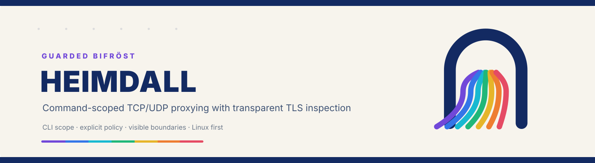
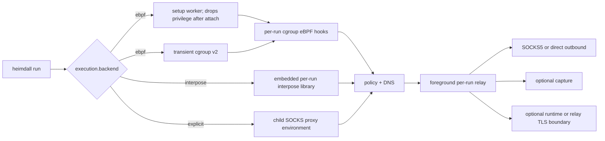

<p align="center">
  
</p>

<h1 align="center">Heimdall</h1>

<p align="center">
  A command-scoped TCP/UDP proxy with transparent TLS inspection for CLI tools and AI agents.
</p>

<p align="center">
  <a href="LICENSE"></a>
  
  
  
  <a href="ROADMAP.md"></a>
</p>

Heimdall runs one command through a named SOCKS5 egress policy without changing
the machine-wide proxy. Linux can select a cgroup eBPF backend that covers the
command's descendant tree, plus daemonless `interpose` and `explicit` reduced
backends. macOS supports architecture-neutral `explicit` on x86_64 and Apple
silicon; `interpose` remains Apple-silicon-only. Reduced backends report their
bypasses and never claim eBPF-equivalent scope.

The mark uses Bifröst as a boundary metaphor: the navy arch is the guarded
crossing, and the spectrum path is the route selected by policy. It describes
the product's scope and visibility; Heimdall is not a general-purpose VPN.

> [!WARNING]
> Heimdall is pre-1.0 software. The command wrapper is usable today, but
> machine-readable contracts and TLS capabilities may evolve. Read the
> [roadmap](ROADMAP.md) before building product or automation dependencies on
> an unreleased surface.

## Why Heimdall?

- **One command, one foreground session** — no backend starts a persistent
  daemon; the Linux eBPF mode strictly scopes interception to the command
  cgroup.
- **Kernel-level coverage** — cgroup eBPF hooks cover dynamic and static
  binaries without interposing a language-specific socket library.
- **Explicit policy** — named outbounds, ordered TCP/UDP rules, fake-DNS
  hostname preservation, direct egress, and fail-closed rejects share one
  strict schema.
- **Three deliberate data boundaries** — proxying, bounded opaque capture, and
  TLS decryption are independent opt-in decisions.
- **Agent-friendly operations** — `heimdall agent` is a read-only, versioned
  JSON preflight with stable error codes and shell-safe argv actions.

## Current status

The shipped core is real and tested; the alpha label reflects the breadth of
Linux kernels, runtimes, TLS libraries, and deployment environments that still
need compatibility hardening.

| Area | Status | Current boundary |
| --- | --- | --- |
| Linux eBPF proxying | Available | Explicit `ebpf` backend; cgroup-scoped IPv4/IPv6 TCP/UDP, SOCKS5 and direct egress, fake DNS, ordered policies, capture, and optional TLS inspection |
| Dynamic-call interposition | Available with reduced scope | Config-selectable on Linux and Apple silicon; authenticated per-run TCP relay and libc fake-DNS mapping, no root or daemon. Static code, direct syscalls, alternate APIs, loader removal, inherited sockets, and unsupported descendants can bypass it; capture and TLS inspection are unavailable |
| Explicit proxy environment | Available with reduced scope | Config-selectable on Linux and macOS x86_64/aarch64 for cooperative SOCKS-aware TCP clients; system DNS, no UDP, capture, TLS inspection, strict scope, or fail-closed claim. The macOS Network Extension prototype remains deferred and excluded from releases |
| Strict configuration and agent contract | Available | TOML, YAML, JSON; required `execution.backend = ebpf | interpose | explicit`; generated offline schema/examples; `heimdall.agent/v10` with exact scope, capabilities, shell-safe actions, and repairable diagnostics |
| Daemonless Linux execution | Available | All decrypt modes own per-run relay, DNS, maps, links, and logs; runtime TLS keeps one unprivileged session helper, never a service |
| Agent event logs and capture | Available | Per-run health and per-flow explanation summaries, fake-DNS, policy, TCP/UDP and TLS evidence plus coalesced bounded blobs with pre-storage allowlists/redaction |
| Runtime TLS decryption | Available daemonless with alpha limits | Active and system-loader OpenSSL images are pre-attached; loader-known images may map after exec; no CA injection or privileged runtime broker |
| Relay TLS decryption | Available daemonless with alpha limits | Local CA plus per-host leaves; upstream certificate failures and downstream alerts/unclean closes remain distinct evidence |
| Static Linux packaging | Available | Reproducible x86_64/aarch64 musl archives, checksums, local release gates, atomic install, one-level rollback, and BTF-preserving artifact-hygiene checks |
| Runtime and kernel compatibility | In development | The full real-eBPF suite covers current and Linux 6.6 LTS NixOS guests on x86_64; pinned Ubuntu 24.04 and Debian 13 guests install the release archive and prove both namespace-free and private-mount fake-DNS strategies, exact authorization, direct TCP/UDP, lifecycle, both TLS modes, logs, and cleanup; native aarch64 still awaits an ARM Linux result |
| Capture analysis | In development | Allowlists, redaction, bounded blocks, orphan recovery, and provenance-linked HTTP/1 header evidence are available; broader analysis remains active work |
| Performance and observability | In development | Repeatable current/6.6 LTS NixOS, Ubuntu 24.04, and Debian 13 real-eBPF latency, RSS, 1/10/50 concurrency, sustained TCP/UDP/capture throughput, and event-integrity baselines are available; broader distribution coverage remains active work |

See [docs/product-contract.md](docs/product-contract.md) for the normative
requirements, [docs/design/macos-backend.md](docs/design/macos-backend.md) for
the reduced macOS source backend and platform boundary,
[docs/design/macos-fallbacks.md](docs/design/macos-fallbacks.md) for the
proxychains/Proxyman research decision, and
[ROADMAP.md](ROADMAP.md) for status and planned work.

## Architecture



In the Linux `ebpf` backend, the foreground CLI owns the relay, fake-IP DNS,
event writer, cgroup, maps, and links for every decrypt mode. A narrow setup
worker attaches eBPF, transfers owned file descriptors back to the CLI, and
immediately drops to the invoking user. The helper stays scoped to the
invocation as a parent-death guard; runtime TLS also needs it to retain Aya's
probe state. The CLI waits for the complete descendant tree and closes every
per-run resource. Processes outside that cgroup are left alone. Reduced
backends own only their documented foreground proxy and injection resources.

The default Linux backend does not use `LD_PRELOAD`: its privileged setup
worker attaches cgroup eBPF hooks, so static binaries and mixed-language
process trees share the same interception boundary. The selectable interpose
backend is intentionally separate and narrower. See
[docs/architecture.md](docs/architecture.md) for data flow and failure
semantics.

## Quick start

Tagged releases provide static x86_64 and aarch64 Linux archives. Follow
[docs/install.md](docs/install.md) to verify its checksum, install or upgrade
atomically, and retain one rollback executable.
The same CLI is also available through npm, PyPI, and Cargo:

```bash
npm install --global heimdall-egress
# or: uv tool install heimdall-egress
# or: cargo install heimdall-egress --locked
heimdall --version
```

Choose a backend in the same config used by `agent` and `run`:

```toml
[execution]
backend = "ebpf" # Linux only; choose interpose or explicit for a reduced path.
```

```bash
heimdall agent --policy default
heimdall run --policy default -- curl https://example.com
```

Use the exact `actions.execute_prefix` returned by `heimdall agent` in
automation. The field is required and Heimdall never guesses or falls back.
On Linux, choose `ebpf` for the complete transparent boundary, `interpose` for
compatible dynamically linked calls, or `explicit` for clients that honor a
SOCKS proxy environment. On macOS x86_64/aarch64, choose `explicit`; Apple
silicon can also choose `interpose`. `ebpf` is unavailable on macOS. Both reduced backends require rejected UDP and disabled
capture/TLS; `explicit` also requires system DNS.

To build the full Linux backend from source instead:

### Requirements

- Linux 5.10 or newer
- cgroup v2 and a running systemd user manager
- Nix with flakes enabled for the pinned development toolchain
- A reachable SOCKS5 server
- `sudo` authorization for the exact hidden `heimdall __setup-worker` command

Refresh the pinned eBPF object before building userspace:

```bash
git clone https://github.com/dravengarden/heimdall.git
cd heimdall

nix develop -c just sync-ebpf
nix develop -c cargo build --workspace --locked --release
```

Install the one binary, create the strict starter configuration, and authorize
only its setup entry point (replace `USERNAME` with the invoking user):

```bash
sudo install -Dm755 target/release/heimdall /usr/local/bin/heimdall
/usr/local/bin/heimdall init
echo 'USERNAME ALL=(root) NOPASSWD: /usr/local/bin/heimdall __setup-worker' \
  | sudo tee /etc/sudoers.d/heimdall >/dev/null
sudo chmod 0440 /etc/sudoers.d/heimdall
sudo visudo -cf /etc/sudoers.d/heimdall
```

Run a command through the default policy:

```bash
heimdall run -- curl https://example.com
heimdall run --policy corp -- ssh internal.example.com
```

Inspect the resulting run without a Web UI:

```bash
heimdall logs list --json
heimdall logs summary --run RUN_ID --json
heimdall logs flow --run RUN_ID --flow FLOW_ID --json
heimdall logs query --run RUN_ID --kind flow.close --jsonl
heimdall logs verify --run RUN_ID --json
heimdall logs recover --run RUN_ID --json # preview only
```

No Heimdall service exists or is needed for proxying, capture, or either TLS
inspection mode.

## Configuration

Keep exactly one configuration file under `/etc/heimdall`:
`config.toml`, `config.yaml`/`config.yml`, or `config.json`. The extension
selects the parser; all syntaxes enter the same strict schema. Unknown or
duplicate fields, wrong types, bad references, contradictory rules, malformed
addresses, invalid CIDRs, and multiple discovered files are rejected with
stable paths and repair hints.

```toml
version = 1

[execution]
backend = "ebpf"

[proxy]
default_policy = "default"

[proxy.outbounds.default]
type = "socks5"
server = "127.0.0.1"
server_port = 1080
network = ["tcp"]

[proxy.policies.default.dns]
mode = "fake"

[proxy.policies.default.final]
tcp = { type = "route", outbound = "default" }
udp = { type = "reject", method = "refused" }

[capture]
mode = "off"

[decrypt]
mode = "off"
```

The three decryption modes are intentionally separate:

- `off` keeps TLS opaque.
- `runtime` observes supported OpenSSL calls inside the client process without
  changing certificate trust. Its setup helper pre-attaches images found in
  active mappings, standard library directories, and `/etc/ld.so.conf`, then
  drops privilege before the workload starts. A loader-known image may map
  after exec; arbitrary private images and unsupported TLS libraries remain
  opaque.
- `relay` terminates and re-issues TLS at the local relay; clients must trust
  the explicit Heimdall CA created by `heimdall tls init-ca`.

Enable bounded capture separately when the relay-observed bytes are needed for
analysis:

```toml
[capture]
mode = "on"
max_bytes_per_flow = 1048576
block_max_bytes = 65536
flush_interval_ms = 100
boundaries = ["transport"]
directions = ["client_to_remote", "remote_to_client"]
redact_env = ["API_TOKEN"]
```

See [docs/config.md](docs/config.md) for limits, validation codes, credentials,
capture boundaries, and TLS security implications.

## Agent workflow

Start automation with one side-effect-free preflight:

```bash
heimdall agent
```

It emits one `heimdall.agent/v10` JSON document containing config validity, the
selected foreground backend and owner, confirmation that no daemon or Web UI
is required, selected policy, capability evidence, stable
repair codes, and exact next commands as argv arrays. Exit `0` means ready,
`1` means not ready, and `2` remains clap usage failure.

Agents should inspect `capabilities.runtime_acceptance`,
`capabilities.cli_acceptance`, and `capabilities.lifecycle` instead of
inferring support from a language or command name. `heimdall agent` never
writes configuration, starts a service, attaches a cgroup, or executes a
workload.

For event analysis, require
`capabilities.logs.flow_summary_contract = "heimdall.logs.flow/v1"`, then use
`actions.logs_schema_flow` and parameterize the placeholder IDs in
`actions.logs_flow`. Every returned action is an argv array, not shell text.

## Command surface

```text
heimdall run [--policy NAME] -- COMMAND [ARGS...]
heimdall agent [--policy NAME]
heimdall config schema|example|validate|explain|show|path
heimdall tls init-ca [--json]
heimdall logs schema|list|path|summary|flow|query|tail|rotate|verify|recover|prune
heimdall init [--dir PATH] [--format toml|yaml|json] [--force]
```

Use `heimdall help -v` for the complete agent-oriented surface. See
[skills/heimdall/](skills/heimdall/) for the bundled workflow skill.

## Verified coverage

The current and Linux 6.6 LTS NixOS real-eBPF acceptance VMs cover static Go `netgo`, Java,
Node.js, Rust, Python, C, curl, and Git. It also exercises connected and
connectionless IPv4/IPv6 UDP, HTTP/3/QUIC, descendant lifetime, command exit
and signal status, two concurrent isolated foreground runs, complete link
cleanup, parent-crash cgroup teardown, and unreachable-upstream fail-closed
behavior without any persistent service.

A separate pinned Ubuntu 24.04 x86_64 KVM guest installs the release archive
through its bundled installer, grants only the exact setup-worker sudo rule,
rejects the same subcommand from a copied binary, and proves direct TCP/UDP,
fake DNS through SOCKS5 while Ubuntu's AppArmor user-namespace restriction
remains enabled, descendant lifetime, SIGHUP/SIGINT/SIGQUIT/SIGTERM forwarding,
concurrent isolation, parent-death cleanup and recovery, runtime and relay TLS
evidence, JSONL integrity, exit propagation, and complete process, listener,
cgroup, and BPF-pin cleanup. QEMU uses user-mode networking and the gate rejects
changes to host links, routes, or rules.

A pinned Debian 13 guest runs the same archive and lifecycle suite against its
stock `files myhostname resolve [!UNAVAIL=return] dns` NSS chain. It proves the
private resolver-mount strategy without editing host NSS state or requiring a
session D-Bus service, and exercises Python 3.13/OpenSSL's stricter relay
certificate-chain verification.

`just benchmark-vm-ubuntu` and `just benchmark-vm-debian` run the same
`heimdall.benchmark/v1` scenario and integrity contract in those guests with 8
GiB of memory, procfs RSS sampling, fake DNS, and SOCKS5 TCP/UDP routing. They
are explicit performance gates, not part of `release-check`; the Ubuntu path
leaves AppArmor and its system-wide user-namespace restriction unchanged.

The NixOS, Ubuntu, and Debian gates test OpenSSL runtime capture and relay TLS
termination against a real TLS server. Generated relay CAs carry explicit
certificate-signing usage and issued leaves carry an Authority Key Identifier;
agent preflight rejects older incompatible CA material before execution. These
results prove the checked-in acceptance paths; they do not claim that every
language TLS implementation or every kernel release is supported. The current
acceptance-matrix work is tracked in the [roadmap](ROADMAP.md).

## Development

Read [CONTRIBUTING.md](CONTRIBUTING.md) before opening a change. Enter the
pinned development environment before running project commands:

```bash
nix develop
```

Common gates:

```bash
just fmt
just test
just verify
just test-vm
just test-vm-ubuntu
just test-vm-debian
```

Optional performance baselines:

```bash
just benchmark-vm
just benchmark-vm-ubuntu
just benchmark-vm-debian
```

The project has no hosted CI workflow by design; `just verify` and the
real-eBPF VM gates are the repository-owned quality gates. Do not infer release
readiness from a badge or from a userspace-only build.

## Security and operations

Heimdall loads privileged eBPF programs and forwards application payloads.
Read [SECURITY.md](SECURITY.md) before authorizing the setup worker, and
[docs/runbook.md](docs/runbook.md) for build order, machine contracts, TLS CA
setup, and failure recovery.

## License

Licensed under [Apache-2.0](LICENSE).
